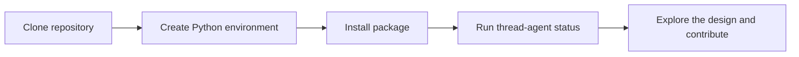
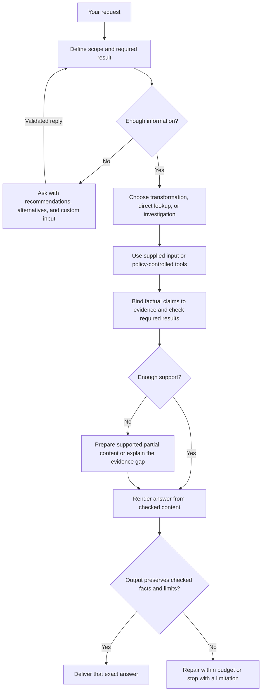

# Thread Agent

**A local-first personal AI agent project designed around checkable answers and human control.**

Thread aims to help you understand project files, remember explicit decisions, and make bounded changes with your approval. Its primary workflow is being designed for a local model without paid API credentials. Hosted models using your own keys and private model servers are planned options.

> **Early development — scaffold only.** You can install the Python package and use its help, version, and status commands today. Chat, model connections, file tools, verification, memory, and human approvals are not implemented yet. This repository contains the design and foundations for those capabilities.

[Quick start](#quick-start) · [Available commands](#available-commands) · [Workflow diagrams](docs/workflows.md) · [Roadmap](#roadmap) · [Contributing](CONTRIBUTING.md)

## What can I use today?

| Capability | Status |
| --- | --- |
| Install from a Git checkout | Available |
| CLI help, version, and implementation status | Available |
| Architecture, specifications, and synthetic examples | Available for review |
| Ask questions about local project files | Planned |
| Run a local model through Ollama | Planned for M1 |
| Clarify requests and approve actions in the terminal | Planned; decisions will survive restarts |
| Remember and correct explicit facts or decisions | Planned for M4 |
| Make approved file edits and check their outcomes | Planned for M4 |
| Use hosted free tiers, paid API keys, or on-premises models | Optional, planned for M4B |
| Web dashboard, messaging, scheduling, and delegation | Deferred extensions |

No model accuracy, agent-task success rate, or hardware performance has been measured. A public source repository is available; a usable agent release is still ahead.

## Quick start

You need **Git and Python 3.11 or newer**. No GPU, model download, or API key is needed to try the current scaffold. Installation may download Python build tooling. The current package has no third-party runtime dependencies.

### macOS or Linux

```bash
git clone https://github.com/KrishnendraPrakash/thread.git
cd thread
python3 -m venv .venv
source .venv/bin/activate
python -m pip install -e .
thread-agent status
```

### Windows PowerShell

```powershell
git clone https://github.com/KrishnendraPrakash/thread.git
cd thread
py -3 -m venv .venv
.\.venv\Scripts\python.exe -m pip install -e .
.\.venv\Scripts\python.exe -m thread_agent status
```

Ensure `py -3 --version` reports Python 3.11 or newer. The Windows commands use the environment's Python directly, so shell activation is unnecessary. Windows setup has not yet been tested by this project.

If you already cloned the repository, start from its directory and skip the clone step. If your virtual environment already exists, reuse it.

Expected output:

```text
Thread Agent 0.0.0.dev0: scaffold only.
Available: package installation, --help, --version, and status.
Not yet available: agent runs, provider connections, memory, or approvals.
Define M0 acceptance fixtures and implement the local M1 workflow.
```

That output confirms the CLI works. It does not test a model connection or run an agent task.



### Optional: use uv

If you already use uv, run this from the checkout:

```bash
uv sync --locked --extra dev
uv run --locked thread-agent status
```

This installs the recorded development dependencies from [uv.lock](uv.lock). The pip instructions use the dependency ranges in [pyproject.toml](pyproject.toml), rather than the uv lock.

## Available commands

Run these with your virtual environment activated:

| Command | What it does |
| --- | --- |
| `thread-agent` | Show help |
| `thread-agent --help` | List supported commands |
| `thread-agent --version` | Show the installed package version |
| `thread-agent status` | Explain which parts are implemented |
| `thread-agent status --json` | Return the same implementation status as JSON |

You can also use `python -m thread_agent` in place of `thread-agent`. On Windows, use `.\.venv\Scripts\python.exe -m thread_agent` if the environment is not activated.

There is **no `run`, `chat`, or model setup command yet**. Files in [configs](configs/README.md), [prompts](prompts/README.md), and `.env.example` are design examples; the CLI does not load them.

## What Thread is being built to do

These are **planned use cases**, not commands you can execute today:

| Example request | Intended behavior |
| --- | --- |
| “What database default is checked into this project?” | Read the relevant file, check the exact value, and cite the source with its scope. |
| “These two documents disagree. Which applies here?” | Compare versions and context, investigate within scope, and explain any remaining uncertainty. |
| “Remember that this project uses SQLite for development.” | Store an explicit attributed decision that you can later correct or delete. |
| “Update this setting in the project.” | Present the concrete change when approval is required, validate current state, apply the authorized edit, and check the result. |

### Planned answer workflow

The amount of checking depends on the task. A direct configuration lookup should take a shorter path than resolving conflicting evidence or changing files.



This overview shows the answer path; [the workflow guide](docs/workflows.md) expands investigation, clarification, retries, and actions. Boxes represent responsibilities, not a fixed number of model calls. Checks improve inspectability; they do not guarantee truth.

### Planned human choices

When an essential detail is missing or an action needs approval, Thread will pause dependent work and offer choices. For example, a **future clarification screen** might look like this:

```text
Which configuration should this answer describe?

1. Checked-in default — Recommended: the file is available to inspect.
2. Running service — Requires an authorized runtime observation.
3. More options
4. Write your own scope
5. Pause
6. Cancel

Waiting for your explicit response…
```

Recommendations and silence will never approve an action. Ambiguous custom replies stay pending. Approvals will apply to the exact proposal and current state; changed proposals need revalidation. Optional questions may also offer Skip.

## Models and deployment options

**No model adapter is connected today.** The intended choices are:

| Mode | Planned setup | Stage |
| --- | --- | --- |
| Local, primary path | Ollama and a model that passes capability and task checks; no paid API credentials | M1 |
| Hosted free tier | Your provider credentials, with visible quota and data terms | M4B, optional |
| Hosted paid API | Your provider credentials and an explicit budget | M4B, optional |
| Private / on-premises | Your endpoint, model ID, authentication, and verified TLS | M4B, optional |

Qwen3.5-9B and Qwen3.5-4B are **evaluation candidates**, not tested defaults. Exact model artifacts, quantization, hardware requirements, and compatibility remain open. Local inference still requires suitable hardware; hosted free-tier availability is provider-dependent.

The design prohibits silent fallback to a cloud or paid provider. Offline policy must also cover tools, search, embeddings, and telemetry. See [model requirements](SPEC.md#8-model-access-and-public-distribution).

## Workflow diagrams

For readable diagrams of each major path, open the [workflow guide](docs/workflows.md):

| Diagram | What it explains |
| --- | --- |
| [Architecture](docs/workflows.md#architecture) | Interfaces, runtime, providers, storage, and policy |
| [Task routing](docs/workflows.md#task-routing) | T0 transformations, T1 lookups, and T2 investigations/actions |
| [Evidence to answer](docs/workflows.md#evidence-to-answer) | Claims, checks, coverage, rendering, and output fidelity |
| [Human decisions](docs/workflows.md#human-decisions) | Recommendations, free text, pause/cancel, and resumption |
| [Model selection](docs/workflows.md#model-selection) | Local and optional providers, capability checks, and failures |
| [Approved actions](docs/workflows.md#approved-actions) | Policy, exact approvals, changed state, execution, and outcome checks |
| [Memory and cache](docs/workflows.md#memory-and-cache) | Attributed facts, corrections, deletion, and invalidation |
| [Failure and recovery](docs/workflows.md#failure-and-recovery) | Safe retries, uncertain effects, budgets, and stopping |
| [Replay and evaluation](docs/workflows.md#replay-and-evaluation) | Reproducible checks without replaying live actions |
| [Contribution workflow](docs/workflows.md#contribution-workflow) | How to make and validate a change today |

The [full architecture Mermaid source](AGENT_ARCHITECTURE.mmd) contains the detailed cross-links. [SPEC.md](SPEC.md) defines the requirements; diagrams illustrate them.

## Project layout

```text
thread/
├── src/thread_agent/    CLI and reserved agent components
├── configs/            Draft local, hosted, and private profiles
├── prompts/            Draft role prompts
├── schemas/            Record and trace schema design locations
├── tests/              Future unit, integration, and acceptance tests
├── evals/              Evaluation cases, fixtures, and grader locations
├── examples/           Synthetic sample projects
├── planning_examples/  Synthetic traces and deliberately negative cases
├── docs/               Workflow diagrams and development guides
├── steering/           Persistent project context for contributors
└── .github/            Scaffold CI and contribution templates
```

Most Python modules currently contain only a responsibility docstring. See the [component map](docs/structure.md) for ownership. The [synthetic traces](planning_examples/README.md) demonstrate intended records and failure cases; they are not real executions or benchmarks.

## Roadmap

| Stage | Deliverable | Current status |
| --- | --- | --- |
| Scaffold | Package, information CLI, docs, examples, and CI configuration | Implemented |
| M0 | Freeze initial tasks, fixtures, schemas, and baseline hardware profile | Not complete |
| M1 | Local model workflow, terminal decisions, scoped reads, sessions, and basic replay | Planned |
| M2 | Evidence-bound claims and answer verification | Planned |
| M3 | Investigation, task promotion, bounded repair, and recovery | Planned |
| M4 | Attributed memory, skills, cache invalidation, and approved edits | Planned |
| M4B | Optional hosted and private model adapters | Planned |
| M5 | External research with source and freshness checks | Planned |
| M6 | Reproducible public release with measured results and license | Planned |

See the [plan](AGENT_PLAN.md) for sequencing and [specification](SPEC.md#10-milestone-gates) for acceptance gates. Proposed numerical targets are not measured results.

## Troubleshooting

| Problem | What to do |
| --- | --- |
| `thread-agent: command not found` | Activate `.venv`, then install with `python -m pip install -e .`. You can also use `python -m thread_agent status`. |
| `No module named thread_agent` | Install the checkout using the same environment's Python that runs the command. |
| Installation rejects your Python version | Check `python --version` inside the environment; Python 3.11+ is required. |
| Status says “scaffold only” | Expected: the agent runtime has not been built yet. |
| `run` or `chat` is rejected | These commands do not exist yet. Use `--help` for available commands. |
| Editing a config or adding an API key has no effect | Configuration loading and providers are not implemented. |

For a source-only smoke check on macOS/Linux, without installing the package:

```bash
PYTHONPATH=src python3 -m thread_agent status --json
```

## Contributing

Start with [CONTRIBUTING.md](CONTRIBUTING.md), [project status](steering/status.md), and the [development guide](docs/development.md). Useful early contributions include acceptance fixtures, design review, and the narrow M1 local workflow.

Install development tools and run the current checks:

```bash
python -m pip install -e '.[dev]'
python -m ruff check .
python -m ruff format --check .
python -m compileall -q src
thread-agent --help
thread-agent --version
thread-agent status --json
```

These check packaging, style, syntax, and the CLI. **There are no behavior tests yet.** A zero-test run is not an acceptance pass. Local scaffold checks were performed with Python 3.12.13; CI is configured for Python 3.11 and 3.12 on Linux. This README does not claim a hosted CI result or cross-platform certification.

For design context, read [SPEC.md](SPEC.md), [RATIONALE.md](RATIONALE.md), and [AGENTS.md](AGENTS.md). The steering Markdown guides project development; it is separate from the planned agent's runtime memory.

## License and release status

A repository license has **not yet been selected**. `thread-agent` is a working package name, not a published package or a verified registry-name reservation. Install from this repository using the commands above. License selection, model notices, compatibility reports, and measured limitations are tracked in the [release checklist](docs/releasing.md).
