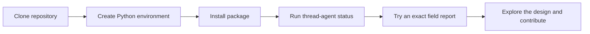
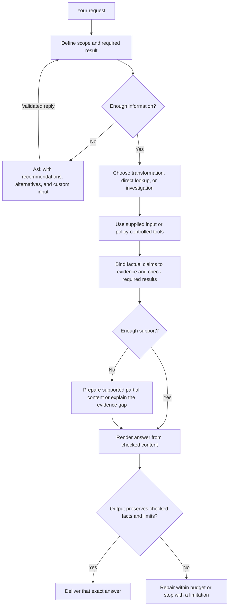

# Thread Agent

**A local-first personal AI agent project designed around checkable answers and human control.**

Thread now has an experimental **VS Code extension** for repository questions, debugging assistance, reviewable feature edits and document summaries. It uses a model you select from local Ollama, without paid API credentials. The original exact-field CLI also remains available.

> **Usable developer preview, not a finished autonomous agent.** General answers are model interpretations with inspectable sources, not independently verified facts. Edits require explicit review and approval. Full model-quality and M1 release gates have not passed.

[Install the VS Code extension](docs/vscode.md) · [Publish a preview](docs/publishing.md) · [CLI quick start](#quick-start) · [Workflow diagrams](docs/workflows.md) · [Roadmap](#roadmap) · [Contributing](CONTRIBUTING.md)

## Start with VS Code

From your checkout, with Python 3.11+, uv, Node.js 22+ and npm installed:

```bash
uv sync --locked --extra dev --extra editor
npm ci --prefix extensions/vscode --ignore-scripts
mkdir -p artifacts
npm run package --prefix extensions/vscode
```

In VS Code, choose **Extensions → … → Install from VSIX…** and select `artifacts/thread-agent-0.1.0.vsix`. Open your repository, run **Thread: Setup Local Model**, select your Python executable and an installed local Ollama text model, then open the **Thread** sidebar. Models are not downloaded automatically.

See the [step-by-step guide](docs/vscode.md) for prerequisites, examples, approval options, document formats, storage and troubleshooting. The extension is tested on macOS; Linux uses the same secure backend primitives but its editor UI remains untested. Windows is not supported by the secure backend yet.

## What can I use today?

| Capability | Current scope |
| --- | --- |
| Repository questions | Bounded lexical search over eligible saved files; cited model interpretations. |
| Debugging assistance | User errors + VS Code diagnostics + source excerpts; optional fix proposals. No breakpoint control. |
| Feature edits | Up to four eligible files, exact diffs, explicit approval, stale-source checks and observed editor-buffer outcomes. |
| Document summaries | UTF-8 text, extracted PDF text and DOCX main body; range selection and explicit limits, no OCR. |
| Human choices | Recommended diff review, apply, alternatives, More, custom instructions, pause and cancel. |
| Run checks | Explicitly select and confirm an existing VS Code task; inspect its terminal output. |
| Exact TOML/JSON reports | Separate deterministic CLI workflow, with optional local model field suggestions. |
| Durable knowledge memory / semantic verification | Planned. |
| Hosted free tiers, paid keys and private endpoints | Optional, planned for M4B. |

“Repository understanding” means retrieving relevant context across the chosen workspace. It does not mean every file is sent to the model or every conclusion is correct. [Coverage and limitations](docs/vscode.md#files-documents-and-model-limits) are part of the result.

## Quick start

You need **Git and Python 3.11 or newer**. No GPU, model download, or API key is needed for exact-field reports. Installation may download Python build tooling. The CLI base package has no third-party runtime dependencies; the optional editor extra adds document/ignore parsers.

### macOS or Linux

```bash
git clone https://github.com/KrishnendraPrakash/thread.git
cd thread
python3 -m venv .venv
source .venv/bin/activate
python -m pip install -e .
thread-agent status
```

### Windows PowerShell

```powershell
git clone https://github.com/KrishnendraPrakash/thread.git
cd thread
py -3 -m venv .venv
.\.venv\Scripts\python.exe -m pip install -e .
.\.venv\Scripts\python.exe -m thread_agent status
```

Ensure `py -3 --version` reports Python 3.11 or newer. The Windows commands use the environment's Python directly, so shell activation is unnecessary. Windows setup has not yet been tested by this project; secure file reads currently require macOS/Linux.

If you already cloned the repository, start from its directory and skip the clone step. If your virtual environment already exists, reuse it.

Expected output:

```text
Thread Agent 0.0.0.dev0: experimental local field lookup.
Available: exact TOML/JSON fields, local model suggestions, saved choices, and replay.
VS Code extension: repository analysis, reviewed edits, and document summaries.
Not yet available: semantic verification, durable memory, or hosted models.
Full M1 acceptance and model accuracy are not established.
Try: thread-agent ask --file examples/projects/minimal/settings.toml --field /database/default
```

Now try a real source report on macOS/Linux, with no model required:

```bash
thread-agent ask --file examples/projects/minimal/settings.toml --field /database/default
```

The report contains `"value": "sqlite"`, the source path, field, and source hash. It describes the captured file, not a running application.

For local-model suggestions, saved choices, and replay, follow the [step-by-step guide](docs/first-workflow.md). `status` reports implementation progress; `doctor` checks local Ollama connectivity.



### Optional: use uv

If you already use uv, run this from the checkout:

```bash
uv sync --locked --extra dev
uv run --locked thread-agent status
```

This installs the recorded development dependencies from [uv.lock](uv.lock). The pip instructions use the dependency ranges in [pyproject.toml](pyproject.toml), rather than the uv lock.

## Available commands

Run these with your virtual environment activated:

| Command | What it does |
| --- | --- |
| `thread-agent` | Show help |
| `thread-agent --help` | List supported commands |
| `thread-agent --version` | Show the installed package version |
| `thread-agent status` | Explain which parts are implemented |
| `thread-agent status --json` | Return the same implementation status as JSON |
| `thread-agent ask --file FILE --field POINTER` | Report an exact scalar field with its source hash |
| `thread-agent ask --file FILE` | Choose a field interactively; optional question and `--model` |
| `thread-agent doctor` | List installed local Ollama models without generating text |
| `thread-agent sessions` | List locally saved sessions |
| `thread-agent resume SESSION_ID` | Resume a saved field choice |
| `thread-agent trace SESSION_ID` | Inspect local records, including captured source content |
| `thread-agent replay SESSION_ID` | Verify a stored source report without live tools or models |

You can also use `python -m thread_agent` in place of `thread-agent`. On Windows, use `.\.venv\Scripts\python.exe -m thread_agent` if the environment is not activated.

There is **no general `run`, `chat`, or model download command**. The `ask` command currently supports exact source-field reports only. Files in [configs](configs/README.md), [prompts](prompts/README.md), and `.env.example` are design examples; the CLI does not load them.

## What Thread is being built to do

These are the broader intended use cases. Exact field reports and reviewed editor changes have experimental implementations; durable memory and general semantic verification remain planned:

| Example request | Intended behavior |
| --- | --- |
| “What database default is checked into this project?” | Read the relevant file, check the exact value, and cite the source with its scope. |
| “These two documents disagree. Which applies here?” | Compare versions and context, investigate within scope, and explain any remaining uncertainty. |
| “Remember that this project uses SQLite for development.” | Store an explicit attributed decision that you can later correct or delete. |
| “Update this setting in the project.” | Present the concrete change when approval is required, validate current state, apply the authorized edit, and check the result. |

### Planned answer workflow

The amount of checking depends on the task. A direct configuration lookup should take a shorter path than resolving conflicting evidence or changing files.



This overview shows the answer path; [the workflow guide](docs/workflows.md) expands investigation, clarification, retries, and actions. Boxes represent responsibilities, not a fixed number of model calls. Checks improve inspectability; they do not guarantee truth.

### Planned human choices

When an essential detail is missing or an action needs approval, Thread will pause dependent work and offer choices. For example, a **future clarification screen** might look like this:

```text
Which configuration should this answer describe?

1. Checked-in default — Recommended: the file is available to inspect.
2. Running service — Requires an authorized runtime observation.
3. More options
4. Write your own scope
5. Pause
6. Cancel

Waiting for your explicit response…
```

Recommendations and silence will never approve an action. Ambiguous custom replies stay pending. Approvals will apply to the exact proposal and current state; changed proposals need revalidation. Optional questions may also offer Skip.

## Models and deployment options

**Local Ollama powers the experimental editor analysis and the separate CLI field-suggestion workflow.** The editor can propose changes; only explicit human review can apply them. The broader provider choices are:

| Mode | Planned setup | Stage |
| --- | --- | --- |
| Local, primary path | Editor analysis and CLI field suggestions use explicit local model selection; full capability/task gates remain pending | Experimental pre-M1 |
| Hosted free tier | Your provider credentials, with visible quota and data terms | M4B, optional |
| Hosted paid API | Your provider credentials and an explicit budget | M4B, optional |
| Private / on-premises | Your endpoint, model ID, authentication, and verified TLS | M4B, optional |

Qwen3.5-9B and Qwen3.5-4B are **evaluation candidates**, not tested defaults. Exact model artifacts, quantization, hardware requirements, and compatibility remain open. Local inference still requires suitable hardware; hosted free-tier availability is provider-dependent.

The design prohibits silent fallback to a cloud or paid provider. Offline policy must also cover tools, search, embeddings, and telemetry. See [model requirements](SPEC.md#8-model-access-and-public-distribution).

## Workflow diagrams

For the implemented editor path, see [the VS Code diagram](docs/vscode.md#architecture-and-validation). For the CLI, see [the first workflow diagram](docs/first-workflow.md#implemented-path). The [broader workflow guide](docs/workflows.md) illustrates the target architecture:

| Diagram | What it explains |
| --- | --- |
| [Architecture](docs/workflows.md#architecture) | Interfaces, runtime, providers, storage, and policy |
| [Task routing](docs/workflows.md#task-routing) | T0 transformations, T1 lookups, and T2 investigations/actions |
| [Evidence to answer](docs/workflows.md#evidence-to-answer) | Claims, checks, coverage, rendering, and output fidelity |
| [Human decisions](docs/workflows.md#human-decisions) | Recommendations, free text, pause/cancel, and resumption |
| [Model selection](docs/workflows.md#model-selection) | Local and optional providers, capability checks, and failures |
| [Approved actions](docs/workflows.md#approved-actions) | Policy, exact approvals, changed state, execution, and outcome checks |
| [Memory and cache](docs/workflows.md#memory-and-cache) | Attributed facts, corrections, deletion, and invalidation |
| [Failure and recovery](docs/workflows.md#failure-and-recovery) | Safe retries, uncertain effects, budgets, and stopping |
| [Replay and evaluation](docs/workflows.md#replay-and-evaluation) | Reproducible checks without replaying live actions |
| [Contribution workflow](docs/workflows.md#contribution-workflow) | How to make and validate a change today |

The [full architecture Mermaid source](AGENT_ARCHITECTURE.mmd) contains the detailed cross-links. [SPEC.md](SPEC.md) defines the requirements; diagrams illustrate them.

## Project layout

```text
thread/
├── src/thread_agent/    Python CLI, editor backend and reserved components
├── extensions/vscode/  VS Code interface, review/edit controls and packaging
├── configs/            Draft local, hosted, and private profiles
├── prompts/            Draft role prompts
├── schemas/            Record and trace schema design locations
├── tests/              Behavior tests and development reference checks
├── evals/              Evaluation cases, fixtures, and grader locations
├── examples/           Synthetic sample projects
├── planning_examples/  Synthetic traces and deliberately negative cases
├── docs/               Workflow diagrams and development guides
├── steering/           Persistent project context for contributors
└── .github/            Scaffold CI and contribution templates
```

The first workflow implements the CLI, scoped reads, field parsing, local suggestions, SQLite sessions, and deterministic replay. The editor backend adds repository retrieval, document extraction and immutable proposals; TypeScript provides the editor integration. Other modules remain responsibility placeholders. See the [component map](docs/structure.md) for ownership. The [synthetic traces](planning_examples/README.md) demonstrate intended records and failure cases; they are not real executions or benchmarks.

## Roadmap

| Stage | Deliverable | Current status |
| --- | --- | --- |
| Editor preview | Repository questions, debugging assistance, reviewed features and document summaries | Experimental; local VSIX available |
| Scaffold | Package, information CLI, docs, examples, and CI configuration | Implemented |
| M0 | Freeze initial tasks, fixtures, schemas, and baseline hardware profile | Ten deterministic development cases added; full freeze pending |
| M1 | Local model workflow, terminal decisions, scoped reads, sessions, and basic replay | Narrow field workflow implemented; full M1 acceptance pending |
| M2 | Evidence-bound claims and answer verification | Planned |
| M3 | Investigation, task promotion, bounded repair, and recovery | Planned |
| M4 | Attributed memory, skills, cache invalidation, and approved edits | Planned |
| M4B | Optional hosted and private model adapters | Planned |
| M5 | External research with source and freshness checks | Planned |
| M6 | Reproducible public release with measured results and license | Planned |

See the [plan](AGENT_PLAN.md) for sequencing and [specification](SPEC.md#10-milestone-gates) for acceptance gates. Proposed numerical targets are not measured results.

## Troubleshooting

| Problem | What to do |
| --- | --- |
| `thread-agent: command not found` | Activate `.venv`, then install with `python -m pip install -e .`. You can also use `python -m thread_agent status`. |
| `No module named thread_agent` | Install the checkout using the same environment's Python that runs the command. |
| Installation rejects your Python version | Check `python --version` inside the environment; Python 3.11+ is required. |
| Status still says “scaffold only” | You have an older checkout/install. Check your source version and reinstall the current checkout. |
| `run` or `chat` is rejected | These commands do not exist yet. Use `--help` for available commands. |
| Editing a config or adding an API key has no effect | Draft TOML profiles are not loaded. The current adapter uses explicit `--model` with loopback Ollama; hosted keys are unsupported. |
| A field choice remains pending | Answer the menu or resume the printed session. Exit code 2 can mean a pending decision. |

For a source-only smoke check on macOS/Linux, without installing the package:

```bash
PYTHONPATH=src python3 -m thread_agent status --json
```

## Contributing

Start with [CONTRIBUTING.md](CONTRIBUTING.md), [project status](steering/status.md), and the [development guide](docs/development.md). Useful early contributions include acceptance fixtures, design review, and the narrow M1 local workflow.

Install development tools and run the current checks:

```bash
python -m pip install -e '.[dev,editor]'
python -m ruff check .
python -m ruff format --check .
python -m compileall -q src
python -m unittest discover -s tests -v
thread-agent --help
thread-agent --version
thread-agent status --json
```

These check style, syntax, the CLI, source-read boundaries, persisted choices, provider validation, and deterministic reference outcomes. They require no model server or paid credentials. A zero-test run is not a pass. Local checks used Python 3.12.13; CI is configured for Python 3.11 and 3.12 on Linux. See [validation and limits](docs/first-workflow.md#validation-and-remaining-work) for the field workflow, and [current validation](steering/status.md) for the editor checks and incomplete M1 gates.

For design context, read [SPEC.md](SPEC.md), [RATIONALE.md](RATIONALE.md), and [AGENTS.md](AGENTS.md). The steering Markdown guides project development; it is separate from the planned agent's runtime memory.

## License and release status

A repository license has **not yet been selected**. `thread-agent` is a working package name, not a published package or a verified registry-name reservation. Install from this repository using the commands above. License selection, model notices, compatibility reports, and measured limitations are tracked in the [release checklist](docs/releasing.md).
