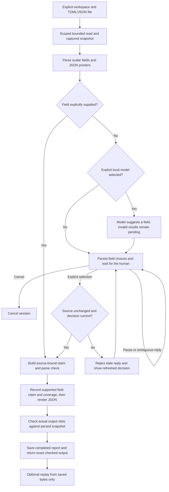

# First working workflow: exact source fields

This **experimental pre-M1 increment** reports scalar values from explicitly selected TOML or JSON files. It is not general chat, code search, semantic question answering, memory, or an editing agent. Full M0/M1 gates remain open.

## 1. Run an exact lookup without a model

From the installed checkout:

```bash
thread-agent ask --file examples/projects/minimal/settings.toml --field /database/default
```

The answer includes `"value": "sqlite"`, the selected field, source path, and SHA-256 of the captured file. The scope is explicitly **captured file contents**, not the running application's configuration. Values are parsed by Python, not generated by a model.

`--field` uses a JSON pointer for both formats: `/database/default` selects that nested field, `/items/0` selects an array item, `~1` escapes a slash in a key, and `~0` escapes a tilde. An empty pointer `--field ''` selects a scalar JSON document root. Containers are not reported as scalar fields; TOML date/time values are represented in ISO format.

For your own project, explicitly choose its root and file:

```bash
thread-agent ask --workspace /path/to/project --file settings.toml --field /database/default
```

Replace the example path and field with ones in your project. Do not combine an exact `--field` with a free-text question: the two interfaces have different scope guarantees.

## 2. Choose a field interactively

```bash
thread-agent ask --file examples/projects/minimal/settings.toml
```

Select a number, enter `field /database/default`, type `more` to see all fields, or use `pause` / `cancel`. Unrecognized custom text triggers clarification. Empty Enter, `yes`, or `skip` cannot silently select a field. Field selection is required, so this workflow has no optional Skip action.

The default recommendation without a model is explicitly the first available field, not an assessment of your intent. The selected source-only scope is echoed before the report is displayed.

## 3. Let an installed local model suggest a field

```bash
thread-agent doctor
```

This checks the local Ollama inventory; it does not generate text, download a model, or certify model quality. Ollama must already be running at `http://127.0.0.1:11434`.

Use an exact installed model name from that list. For example, the development machine had `llama3.1:8b` installed:

```bash
thread-agent ask "What database default is configured in this file?" \
  --file examples/projects/minimal/settings.toml \
  --model llama3.1:8b
```

The model receives your question and available field pointers, **not the source values**. It suggests one field using a constrained JSON response. You must confirm the scope before a value is reported. A valid model schema is not treated as proof that it understood the original question.

If Ollama is unavailable or its output is invalid, the session explains the problem and leaves a manual field choice pending. It does not select a different model or provider. Questions about multiple fields, causality, runtime state, or conflicting files remain outside this increment; choosing a field only narrows the request to a source report.

No model is selected by default, and no model is downloaded automatically. Known cloud-backed profiles are rejected. The client only contacts the literal loopback address, ignores proxy environment variables, follows no HTTP redirects, and supplies no action tools. The local Ollama installation is a trusted dependency; this is not a certification of every server configuration or complete future offline policy.

## 4. Pause and resume

```bash
thread-agent sessions
thread-agent resume SESSION_ID
```

Replace `SESSION_ID` with the saved ID. Pending questions survive process restarts. If a source changed, the old response is rejected and a new decision is shown. Repeated replies to completed or cancelled decisions cannot rerun them.

For noninteractive use:

```bash
thread-agent ask --file examples/projects/minimal/settings.toml --no-input
thread-agent resume SESSION_ID --decision DECISION_ID --reply 1
```

Copy both IDs from the displayed session. A stale decision ID is rejected. Exit codes are **0** for completed/cancelled commands, **2** for a pending decision or invalid CLI usage, and **1** for a runtime error.

## 5. Inspect and replay

```bash
thread-agent trace SESSION_ID
thread-agent replay SESSION_ID
```

Trace output includes captured source content, questions, replies, checks, and available model metadata. Keep it private if the source is private. Replay reparses the stored bytes, checks the source hash, verifies the recorded claim/check/render sequence, and compares the answer. It never reads a live source, calls a model, or performs an external action. It verifies the recorded source report, not today's file contents or the original natural-language question's meaning.

This is **deterministic source-report replay**, not strict model-trajectory replay. Changing models or prompts still needs fresh evaluation.

## Local state and limits

- Sessions are stored under `.thread-agent/sessions.sqlite3` in the directory where you launch the command. The folder is ignored by Git. No conversation is sent to a hosted service by this client.
- Use `thread-agent --state-dir /path/to/private/state COMMAND ...` to choose another location. Reuse that location when listing or resuming sessions; printed resume commands include it.
- Selected source bytes and user/model records remain there until you delete that state directory. Automated retention, selective deletion, and durable memory are not implemented.
- Source reads currently require macOS/Linux descriptor-based path checks. Windows can use help/status but secure source reads are disabled pending implementation and testing.
- Sources must be relative, non-hidden `.toml` or `.json` files inside the selected workspace: no traversal, symlinks, hard links, devices, or FIFOs.
- Limits: 32 KiB per UTF-8 file, 64 scalar fields, nesting depth 16, pointer length 512 characters, question length 1,024 UTF-8 bytes, and reply length 2,048 bytes. Oversized inputs fail explicitly rather than silently truncating.
- Duplicate JSON keys and non-finite numbers are rejected. The model profile uses a conservative byte-based input bound, an 8,192-token context request, and a 256-token output limit. Exact tokenizer accounting and general budget enforcement remain M1 work.
- Only one optional field-suggestion generation occurs per new session. There is no automatic generation retry, source edit, shell tool, or cloud fallback.

## Implemented path



## Validation and remaining work

The ten [development fixtures](../evals/cases/development/field_lookup.json) exercise deterministic source reports. Their reference answers remain outside the source workspace. Boundary tests cover invalid sources, scoped reads, ambiguous/repeated/stale replies, restart, model errors, and replay tampering. CI runs these with synthetic provider responses and no model server.

One live smoke call on macOS arm64 / Python 3.12.13 used already-installed Ollama 0.34.2 and `llama3.1:8b` Q4_K_M (digest `46e0c10c039e019119339687c3c1757cc81b9da49709a3b3924863ba87ca666e`). It suggested `/database/default`; a scripted fixture confirmation produced `sqlite`, and stored-source replay passed. This is one integration observation, not a model benchmark, latency gate, hardware certification, or full human-interaction acceptance result.

The broader [specification](../SPEC.md) still requires complete record schemas, tokenizer-aware budgets, all HIL scenarios including action approvals, general routing, model/tool capability gates, and strict trajectory replay before M1 is accepted. General synthesis, writes, durable memory, and additional providers remain staged. The existing Qwen candidates have not been evaluated or replaced by a certified default.

Adapter protocol references: [Ollama chat](https://docs.ollama.com/api/chat), [installed model inventory](https://docs.ollama.com/api/tags), and [structured outputs](https://docs.ollama.com/capabilities/structured-outputs).
