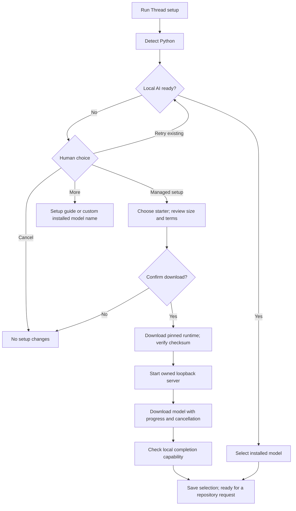

# Local AI setup managed by Thread

Version 0.2.0 adds an optional managed setup for **Apple Silicon Macs running macOS 14 or newer**. It avoids asking developers to install Ollama with Homebrew, run Docker, configure a server, or type model-download commands. Python 3.9+ still needs to exist on the machine; Thread detects it automatically. Linux and Intel Mac users can continue using an existing local Ollama server.

## Developer workflow

1. Install/update the extension and open a trusted local project.
2. Run **Thread: Setup Local Model**.
3. If Ollama or its models are missing, choose **Set up local AI for me (Recommended)**.
4. Choose the small starter or larger model. Their download sizes and limitations are displayed.
5. Confirm **Download and set up** after reviewing the runtime/model identity, size, storage location and model terms.
6. Wait for completion, then run **Thread: Ask About Repository**. Progress and cancellation are available during setup.

The confirmation authorizes only the selected runtime/model download and local initialization. It does not approve source changes, task execution, cloud inference or other downloads. **Retry existing Ollama**, **More options**, custom installed-model name entry, and **Cancel** remain available. There is no automatic paid fallback.

## Downloads and storage

| Component | Initial download | Source / terms |
| --- | --- | --- |
| Ollama 0.34.4 macOS runtime | 160 MB | [Official release](https://github.com/ollama/ollama/releases/tag/v0.34.4); its archive notices are retained |
| qwen2.5-coder:1.5b | About 986 MB | [Model details and Apache 2.0 terms](https://ollama.com/library/qwen2.5-coder:1.5b) |
| qwen2.5-coder:7b | About 4.7 GB | [Model details and Apache 2.0 terms](https://ollama.com/library/qwen2.5-coder:7b) |

The small starter is recommended for download size, not certified answer quality. Allow at least 4 GB free disk for small-model setup or 10 GB for the larger model. Memory requirements depend on model, context and other applications; passing a disk check does not establish enough RAM. Model tags can change upstream; the displayed sizes are estimates. An analysis records the installed artifact metadata as before.

The installer verifies the pinned runtime SHA-256 (`e9c8fddaab5f48f47f2c4ae3d23d0732f5182417125353faeed2188e34a22799`) and byte size before extracting regular files and safe internal links into extension-owned storage. It never executes a downloaded install script or modifies a project environment. Ollama verifies model layers during its pull operation.

Runtime and model files live under Thread’s VS Code global storage in `local-runtime/`. The download confirmation shows the full location. Ollama may also create normal per-user configuration such as its identity keys. Its managed model store is separate from an existing `~/.ollama/models` store.

The server binds to a private `127.0.0.1` port with cloud mode disabled. The extension instance starts its saved runtime on demand and stops its owned server on disposal. It does not stop or replace an existing Ollama server. Keep one Thread window active during managed downloads; multiple windows can consume additional memory with their own servers. This is local desktop support, not a remote-host/container or hostile-process sandbox guarantee.

## Recovery

- **Cancelled model download:** rerun setup and select the model again. Ollama can reuse partial downloaded layers; a runtime archive download restarts if it did not finish.
- **Runtime checksum/size mismatch:** installation stops before the runtime is accepted. Retry setup; do not bypass the check.
- **Insufficient disk:** free space, then rerun setup. There is no automatic deletion of your models or other files.
- **Another install is active:** wait for that setup to finish or cancel it. After a crash, close all Thread windows before removing only `install.lock` and incomplete `download-*` temporary folders from the displayed `local-runtime` directory. Keep completed `ollama-*` folders and `models`. Reopen VS Code and retry.
- **Runtime startup or inference failure:** rerun setup, check the reported error, or use an existing Ollama installation. OS/hardware limitations cannot be fixed by changing a Python path.
- **Reset analysis:** **Thread: Clear Saved Analysis** clears the active analysis, not the runtime/model files.
- **Remove managed files:** close Thread/VS Code first and remove its `local-runtime` directory through the file manager. This removes downloaded models; a later managed setup will download them again. It does not uninstall Python or an independent Ollama app.

## What has been tested

The real pinned runtime was downloaded to a temporary directory, checksum-verified, extracted, started on a private loopback port, checked for version 0.34.4 and an empty model inventory, and stopped. The developer’s existing Ollama server was not changed. Synthetic tests cover invalid archives, checksum rejection, transfer success/error/cancellation, endpoint restrictions and editor setup recovery.

A complete starter-model download/inference trial on a clean machine has **not** been performed. Neither starter model is accuracy-certified. Managed installation is not yet provided for Linux, Intel Mac or Windows. This preview reduces manual installation work; it is not a dependency-free or zero-download product.

