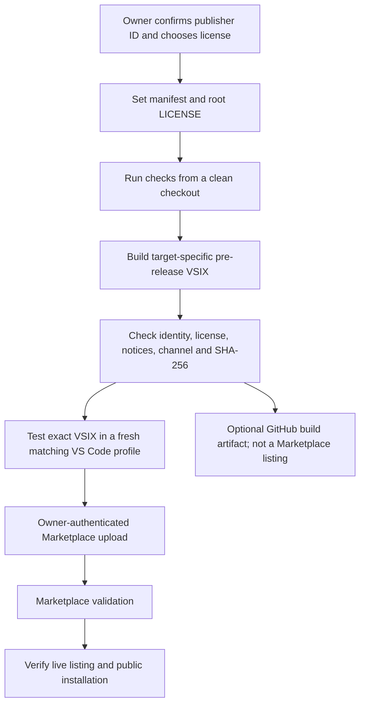

# Publish the Thread VS Code preview

A Marketplace listing makes Thread searchable and installable from VS Code. Thread does not need a hosted server: each user runs Python 3.11+, local Ollama and their selected text model. A GitHub code push alone does not create a Marketplace listing.

The owner has requested public distribution. The release candidate remains an experimental preview; full quality/M1/M6 gates are incomplete. Marketplace account setup and the project's license decision must be completed before this repository's public-package command will proceed. The existing publisher value in package.json is an unverified placeholder, not proof of ownership.

## One-time owner setup

1. Sign in to [Marketplace publisher management](https://marketplace.visualstudio.com/manage) with your Microsoft account.
2. Create a publisher, or select one you already own. Record its exact **ID**. A GitHub username is not automatically a Marketplace publisher. The ID cannot be renamed after creation.
3. Set `publisher` in `extensions/vscode/package.json` to that exact ID. Confirm the same publisher will own the extension before the first upload; its public extension ID is `publisher.thread-agent`.
4. Choose the project's license. Add the actual license text as root `LICENSE`, and set the extension manifest's `license` field accordingly. The current `UNLICENSED` value is intentionally not silently changed. Packaging copies the selected root license and retains bundled dependency notices.
5. Read the public README, changelog, privacy document and known limits. The initially tested editor platform is **macOS Apple Silicon (`darwin-arm64`)**. Other macOS/Linux package targets are available to build, but need their own installation/editor validation before being advertised as tested. Windows and web packages are not offered.

No credentials need to be pasted into chat, code, README files or commit messages. Manual upload through the signed-in Marketplace page avoids configuring a command-line token for the first release.

## Build the reviewed public package

From the repository root, after the owner setup:

```bash
uv sync --locked --extra dev --extra editor
npm ci --prefix extensions/vscode --ignore-scripts
.venv/bin/python -m unittest discover -s tests -v
.venv/bin/python extensions/vscode/scripts/bundle.py
npm test --prefix extensions/vscode
npm run release:check --prefix extensions/vscode -- --publisher YOUR_PUBLISHER_ID
npm run package:preview --prefix extensions/vscode -- --publisher YOUR_PUBLISHER_ID --target darwin-arm64
```

Replace `YOUR_PUBLISHER_ID` with the actual ID; do not use that literal placeholder. The check verifies local configuration, not Marketplace identity ownership. The packaging command uses the pre-release channel, checks manifest/target/license consistency and dependency notices, and writes:

- `artifacts/thread-agent-0.1.0-darwin-arm64.vsix`
- `artifacts/thread-agent-0.1.0-darwin-arm64.vsix.sha256`
- `artifacts/thread-agent-0.1.0-darwin-arm64.release.json`

Versioned names follow package.json if the version changes. The release record contains the commit, dirty-worktree indicator, package identity and SHA-256. Build from a clean checkout for an attributable public artifact. Test the **exact packaged VSIX** in a fresh VS Code profile, including local setup and the four workflows, before upload. Install it through **Extensions → … → Install from VSIX…**. Do not substitute the older generic local-development VSIX for this checked release package.

## Build through GitHub Actions instead

After committing the confirmed publisher/license configuration, open the repository's **Actions → Build VS Code preview for publication → Run workflow**. Enter the publisher ID and package target. The workflow installs locked dependencies, runs deterministic checks and uploads the checked VSIX/checksum/release record as a build artifact. Download it from that run and continue below. An Actions artifact is not a Marketplace listing or a public GitHub Release. This workflow has read-only repository permissions and does not publish automatically.

## Publish in the browser

1. Open [Marketplace publisher management](https://marketplace.visualstudio.com/manage) and select the publisher whose ID matches the package.
2. Choose **New extension → Visual Studio Code** and upload the target-specific preview VSIX. For an existing extension, use its update action instead.
3. Complete the Marketplace upload flow and wait for its validation. Resolve any reported issue rather than bypassing checks.
4. Verify the resulting listing at `https://marketplace.visualstudio.com/items?itemName=YOUR_PUBLISHER_ID.thread-agent`. This is a URL pattern, not an assertion that the listing already exists.
5. From a separate clean VS Code profile on a matching platform, search the exact extension ID, choose **Install Pre-Release Version**, and run Setup. Confirm the installed version and run a small repository request.

Only after that verification should README installation instructions point users to a live listing. Availability to other platforms requires uploading their matching tested packages. The extension still requires Python, Ollama and an installed local text model on each user's machine; it does not bundle those runtimes or model weights.

## Optional terminal publishing

The checked package can also be published with the repository's installed vsce:

```bash
extensions/vscode/node_modules/.bin/vsce publish --azure-credential --packagePath artifacts/thread-agent-0.1.0-darwin-arm64.vsix --pre-release
```

This requires a configured Microsoft Entra identity with permission on the publisher. It is not configured by this repository. The [official publishing guide](https://code.visualstudio.com/api/working-with-extensions/publishing-extension) documents Microsoft Entra authentication and the browser-upload route. It currently states that global Azure DevOps PATs retire on December 1, 2026; do not build a new long-term publishing pipeline around copied PATs. Do not pass tokens in command arguments or commit them.

A public GitHub pre-release with the same VSIX/checksum/release record is an optional direct-download channel. It is separate from Marketplace indexing and updates. Neither the local packaging command nor the CI build publishes automatically.

## After the first preview

Keep `preview: true` and the pre-release channel until the planned release gates are satisfied. Use a new numeric version for each upload; VS Code does not use a `-beta` suffix for Marketplace pre-release versions. Update the changelog, rerun checks, validate the built artifact, then publish it under the same confirmed extension identity. For a faulty release, prefer a corrected higher version and explain the issue; do not silently rewrite a released package.

References: [publishing and publisher accounts](https://code.visualstudio.com/api/working-with-extensions/publishing-extension), [extension manifest](https://code.visualstudio.com/api/references/extension-manifest), [platform and pre-release packages](https://code.visualstudio.com/api/working-with-extensions/publishing-extension#platform-specific-extensions).

## Publication workflow

[Editable Mermaid source](publishing-workflow.mmd)


