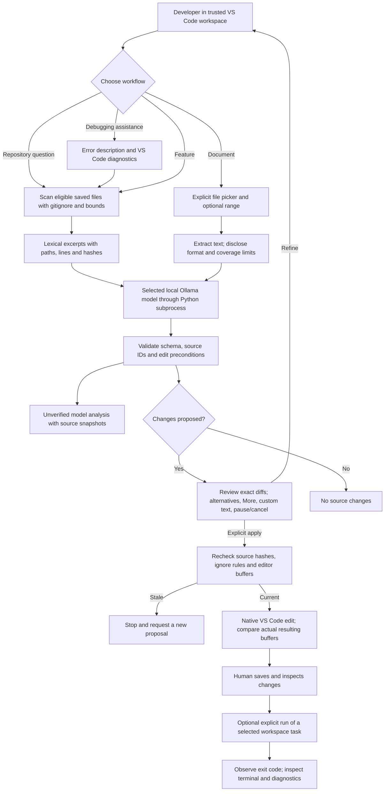

# Use Thread in VS Code

Thread's experimental VS Code extension can answer questions across eligible repository files, help diagnose errors, propose small features as reviewable edits, and summarize documents. Inference uses your installed local Ollama model. There is no paid API requirement or automatic model download.

It is a bounded assistant: retrieved sources make its answers inspectable, but explanations and generated code still need review. This is not full-repository semantic analysis or an autonomous debugger.

## Build and install from this public repository

Requirements: macOS or Linux, Python 3.11+, Node.js 22+, npm, VS Code 1.95+, and Ollama with an installed text completion model. Building requires internet access for dependencies. After setup, Thread calls only literal loopback Ollama; VS Code and user-selected tasks have their own network behavior.

From the repository root:

```bash
uv sync --locked --extra dev --extra editor
npm ci --prefix extensions/vscode --ignore-scripts
mkdir -p artifacts
npm run package --prefix extensions/vscode
```

Without uv, create `.venv` and install `python -m pip install -e '.[dev,editor]'` there before running the npm commands. uv uses the lock file; pip uses the declared ranges. Packaging bundles the Python core, pathspec and pypdf with their distribution notices, so the installed extension needs a Python interpreter but no separate pip install.

1. Open VS Code → Extensions.
2. Open the **…** menu → **Install from VSIX…**.
3. Select `artifacts/thread-agent-0.1.0.vsix` from your checkout.
4. Open the repository you want help with and trust it if appropriate.
5. Open the command palette and run **Thread: Setup Local Model**.
6. Enter your Python 3.11+ executable. Use an absolute path if VS Code cannot find `python3`; `python3 -c 'import sys; print(sys.executable)'` prints it in your terminal.
7. Select an installed local Ollama text model. Embedding-only and detected cloud-backed models cannot run analysis. No model is preselected or certified.
8. Open the **Thread** activity-bar icon, choose a workflow, write your request and click **Send**.

You can alternatively install with `code --install-extension artifacts/thread-agent-0.1.0.vsix` when the VS Code shell command is configured. This is a local VSIX build; the extension is not published to the Marketplace. The repository license decision remains open.

## Four workflows

| Workflow | Try this | What happens |
| --- | --- | --- |
| Ask about repository | “Where is authentication handled, and how does a request reach it?” | Scans eligible saved files, selects relevant excerpts and returns model interpretations with source references. |
| Diagnose a problem | “This function returns -1 for add(2, 3). Explain why and propose a fix.” | Combines your description with VS Code diagnostics and retrieved source; may propose a patch. |
| Propose a feature | “Add input validation to this function and propose an associated test.” | Produces up to four file changes, if exact source matches and path policy permit them. Nothing applies automatically. |
| Summarize a document | “Summarize the requirements and unresolved decisions.” | You choose the document and optional range. Each bounded extracted section receives a source-linked summary. |

Use precise symbol names and keep the relevant file open to improve lexical retrieval. Save or revert workspace edits before a repository request. Thread reads saved files, not unsaved buffers. A follow-up is a fresh request; this version does not automatically include earlier conversations.

Source buttons open captured excerpts and metadata, rather than silently opening a potentially changed live file. The coverage panel shows discovery counts, selected excerpts, limits and extraction notes. A real source reference does **not** establish that the model's interpretation is correct.

## Review and apply a feature or fix

1. Choose **Review proposed changes** or run **Thread: Review Pending Changes**.
2. Choose **Review a diff (recommended)**, inspect the before/after editor, and explicitly confirm **Reviewed this diff**. Repeat for every file in that review session.
3. Choose **Apply to editor buffers**, then explicitly confirm **Apply reviewed changes**.
4. Thread rechecks source dependencies and the current buffers. Changed or newly excluded sources stop the application.
5. Inspect and save the edited files. Existing-file edits remain unsaved; native creation may create new files on disk.
6. Run your project checks. **Thread: Run a Workspace Task** lets you explicitly choose and confirm an existing task. Check its terminal output; an exit code alone is not proof of feature correctness.

Alternatives include **Refine with my own instructions**, **More options** (captured evidence and suggested checks), **Pause review** and **Cancel proposal**. Custom text requests a new proposal; it never approves an old one. Pausing preserves the proposal across reloads, but diff review confirmations must be repeated. A consumed or uncertain proposal cannot be reused. Undo and Git diffs remain normal VS Code tools; Thread does not auto-save, commit, push or roll back your project.

Task execution uses the configured task, including any configured dependencies and environment. It does not execute generated shell commands. Tasks may have broader effects than source edits; choose only tasks you intend to run. Thread does not read arbitrary terminal output or operate debug breakpoints.

## Files, documents and model limits

| Boundary | Current behavior |
| --- | --- |
| Repository scan | Up to 3,000 files / 16 MiB total, 96 KiB per file, 20,000 directory entries visited. Root and nested .gitignore apply. |
| Source selection | Up to six lexical excerpts, at most two per file, about 6,500 UTF-8 bytes total. Active file gets extra weight. No vector database or language-server symbol graph. |
| Exclusions | Hidden paths except .github, common generated/vendor directories, known secret names, unsupported/binary files, symlinks and hard-linked files. This is not a universal secret detector. Git global excludes and .git/info/exclude are not loaded. |
| Edits | Up to four eligible text files. Exact unique replacement or new file under an existing directory. No deletion, rename, new directories or ignored-file editing. |
| Documents | UTF-8 TXT/Markdown/RST/CSV/log/JSON/YAML/TOML, PDF extracted text, DOCX main-body paragraphs including table paragraphs. |
| Extraction omissions | No OCR, scanned-image interpretation, legacy .doc, Excel/PowerPoint, PDF layout guarantee, DOCX headers/footnotes/images, or multi-document conflict resolution. |
| Document bounds | 8 MiB input, at most 200 PDF pages, bounded decompression, 32,000 extracted UTF-8 bytes, up to 12 section summaries. Blank or oversized selections stop with an explanation. |
| Document range | Optional `1-10`: one-based inclusive PDF pages, DOCX paragraphs, or text lines. Export a smaller PDF if the file/page limits are exceeded. |
| Model budget | Sequential local requests; context 16,384 and output cap 3,072 per call, with a conservative input-byte check. Whole lower-ranked excerpts are removed if needed to fit; the reported sources reflect that reduction. Exact tokenizer accounting remains unimplemented. |
| Platforms | macOS tested. Secure backend supports POSIX macOS/Linux primitives; Linux editor UI is not yet tested. Windows, virtual workspaces and remote-host workflows are not supported/tested release profiles. |

Small models can produce rejected patches or poor interpretations. Rephrase/narrow the request or explicitly choose a different installed model; Thread does not silently fall back. Multi-section document summaries are section-by-section, not a guaranteed global synthesis. Inspect partial extraction notes before treating a summary as complete.

## Storage, cancellation and troubleshooting

The latest completed analysis is stored in VS Code workspace state, including source excerpts, proposal before/after content, exact model inputs/raw outputs and available usage metadata. It is separate from CLI SQLite sessions. A new completed request replaces it; failed calls do not have a complete retained audit trail. There is no durable knowledge memory or multi-session history yet.

**Thread: Clear Saved Analysis** removes that active workspace entry and in-memory snapshots. This does not erase editor undo history, VS Code backups, or physical database remnants. Avoid sensitive workspaces where these limitations are unacceptable.

**Stop** / **Thread: Cancel Current Request** terminates the client subprocess and rejects its result. Ollama may briefly finish server-side inference after disconnection. It cannot apply source changes. A task already explicitly launched is a separate VS Code task: stop it with VS Code's task controls.

- **Python cannot start / version too old:** rerun Setup with an absolute Python 3.11+ path.
- **Cannot use local Ollama:** start your Ollama server and verify its installed model list. Thread uses `http://127.0.0.1:11434` on the extension host.
- **Embedding model / cloud model rejected:** choose an installed local text completion model.
- **Input too large / malformed or truncated output:** use a more focused request or smaller document range; no partial patch is accepted.
- **No eligible sources:** inspect .gitignore, supported extensions and size limits.
- **Stale proposal / uncertain application:** inspect the editor and Git diff, then request a new proposal. Never blindly retry a consumed approval.

The process boundary is not an OS sandbox. These checks protect ordinary scoped workflows, not a hostile process concurrently replacing workspace files. Use one VS Code window per working tree when reviewing changes.

## Architecture and validation

The [editable Mermaid diagram](vscode-workflow.mmd) shows the implemented path.


 The Python field CLI remains available separately; its deterministic field reports have different guarantees from general model analysis.

Local validation includes Python policy/workflow tests, TypeScript subprocess tests, an isolated VS Code Extension Host fixture and a live local-model synthetic smoke case. Exact results are recorded in [steering/status.md](../steering/status.md). These are implementation checks, not a model-quality benchmark or full M1 acceptance.

To work on the extension:

```bash
uv sync --locked --extra dev --extra editor
npm ci --prefix extensions/vscode --ignore-scripts
.venv/bin/python extensions/vscode/scripts/bundle.py
npm test --prefix extensions/vscode
.venv/bin/python -m unittest discover -s tests -v
npm run test:host --prefix extensions/vscode
```

The host test uses an installed macOS VS Code by default and a temporary repository/profile. On another supported setup, set `VSCODE_EXECUTABLE` to its executable. It uses scripted approvals only in that synthetic fixture. It does not touch your working repository or install into your normal editor profile.

Implementation references: [VS Code webviews](https://code.visualstudio.com/api/extension-guides/webview), [VS Code API](https://code.visualstudio.com/api/references/vscode-api), [VSIX packaging](https://code.visualstudio.com/api/working-with-extensions/publishing-extension), [pypdf text extraction](https://pypdf.readthedocs.io/en/stable/user/extract-text.html).
