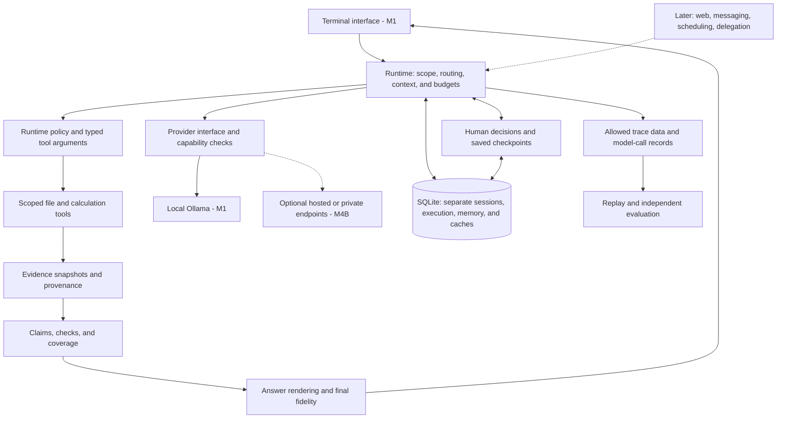
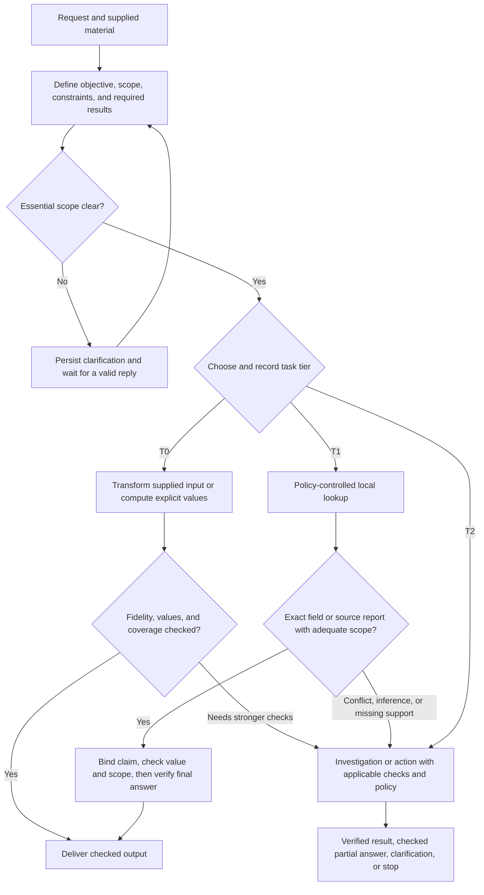
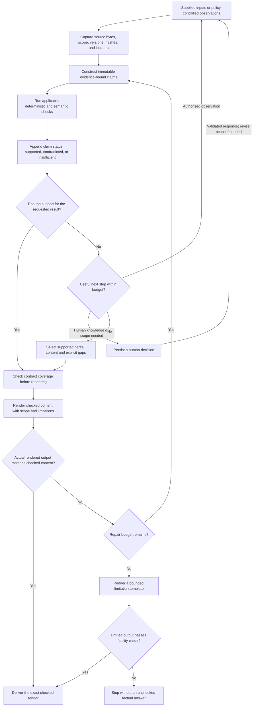
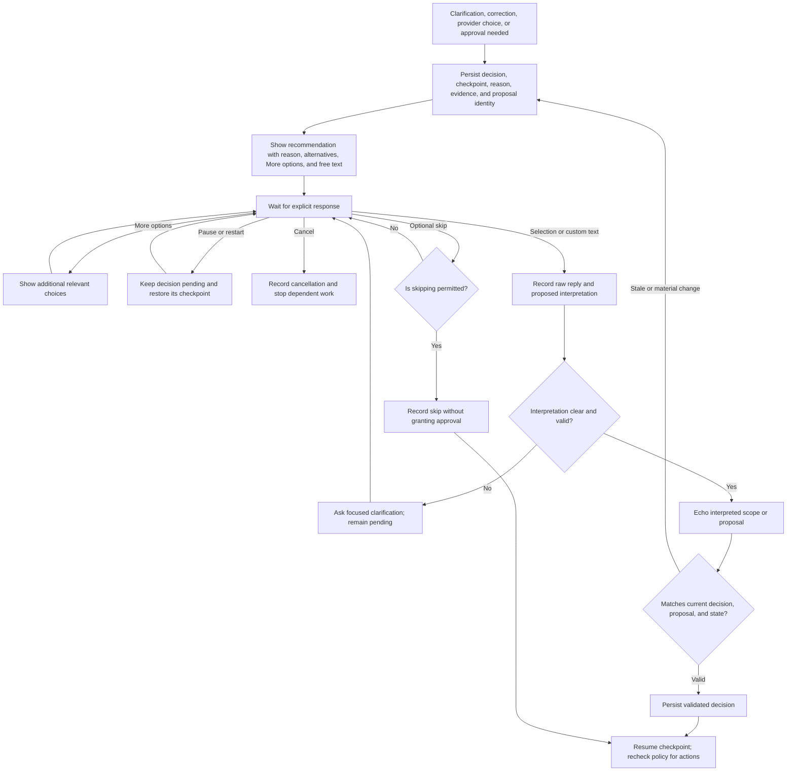
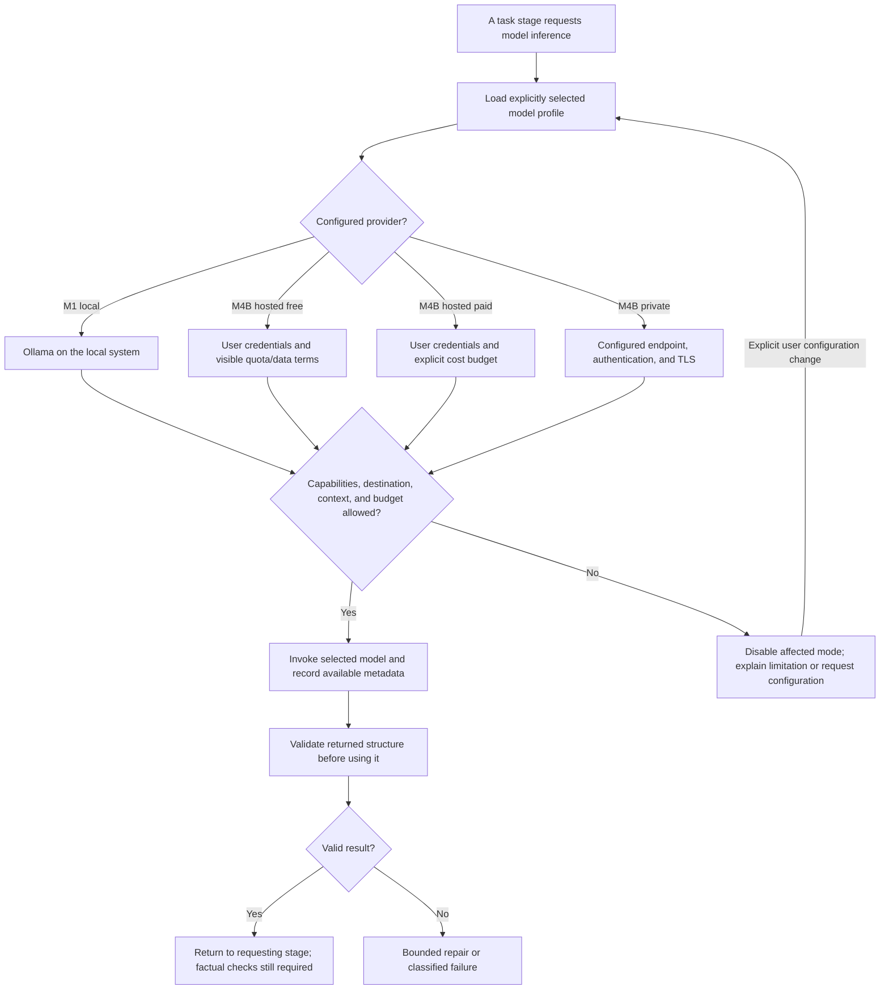
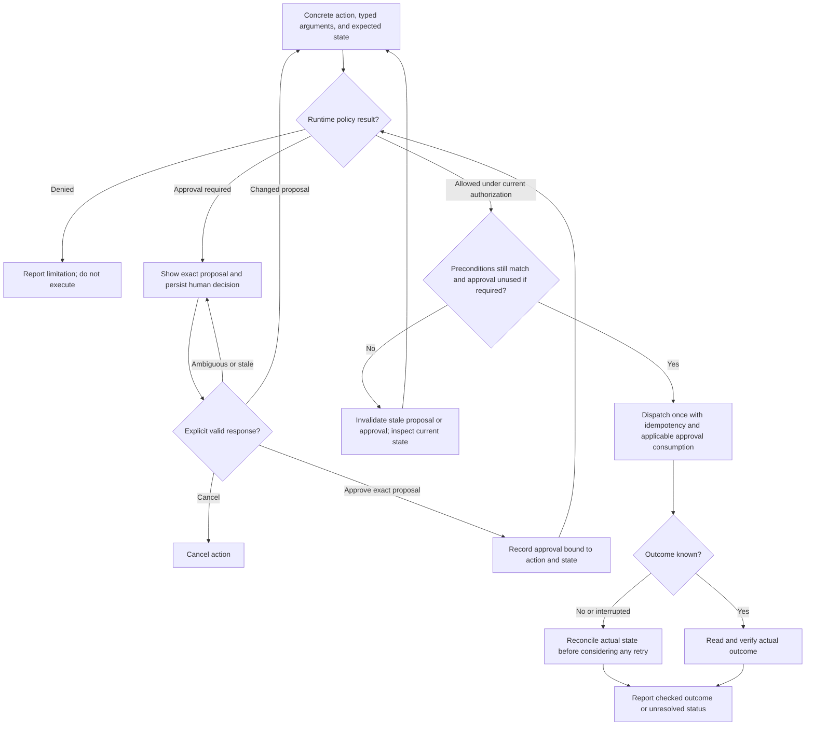
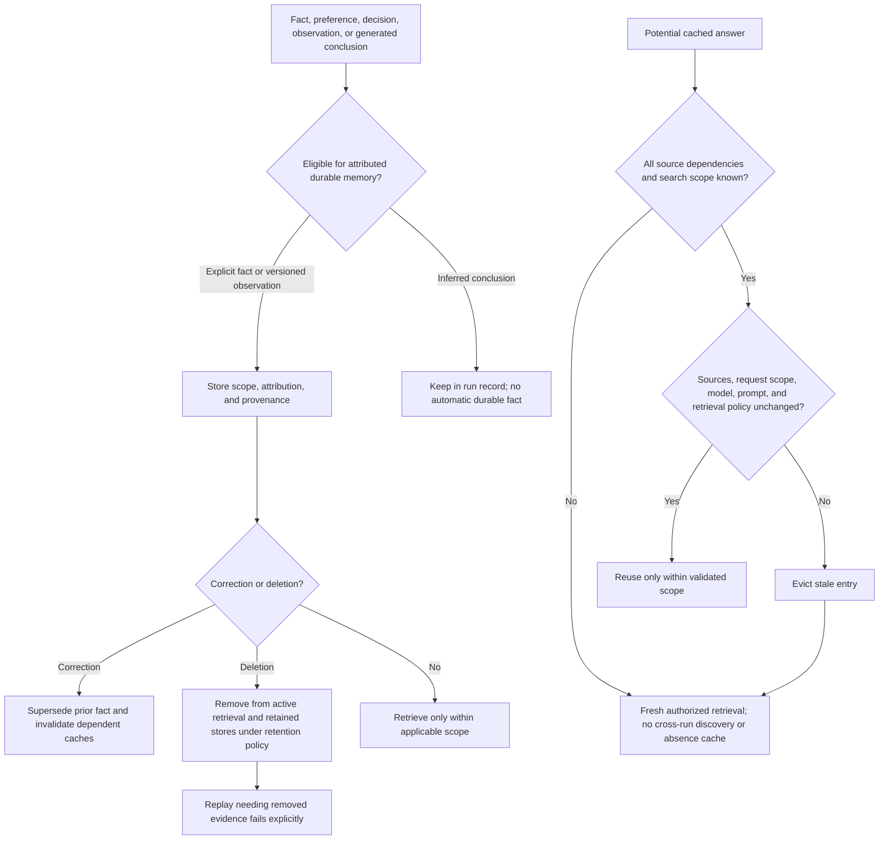
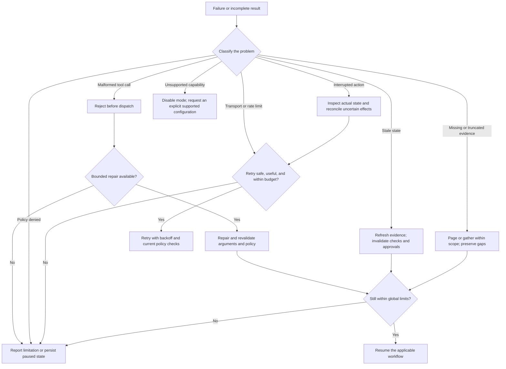
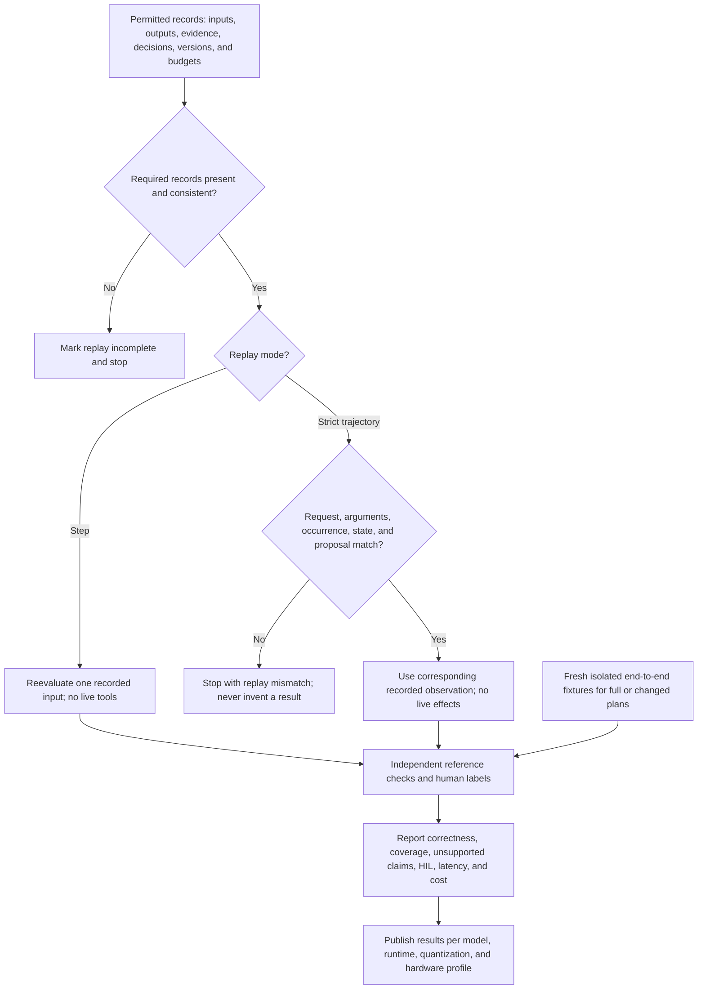
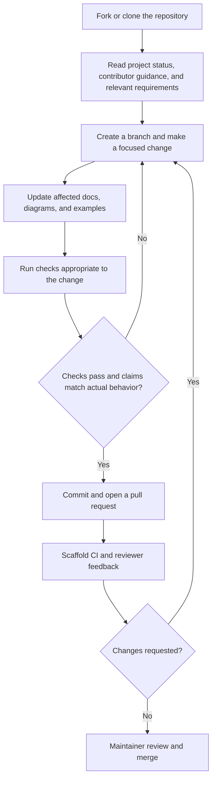

# Workflow guide

For the implemented developer extension, see [VS Code workflows](vscode.md) and its [Mermaid source](vscode-workflow.mmd). The broader architecture diagrams below remain targets except where marked implemented.

[Back to the README](../README.md)

Thread now has an [experimental direct-field workflow](first-workflow.md) with local suggestions, saved field choices, and source-report replay. **The diagrams below describe the broader target architecture; they do not imply complete implementation.** The separate first-workflow guide shows the implemented path. The final contribution workflow describes current development.

These diagrams split the [full architecture](../AGENT_ARCHITECTURE.mmd) into readable views. Nodes describe responsibilities, not separate services or mandatory model calls. [SPEC.md](../SPEC.md) is authoritative. Every tool operation must pass runtime policy; arrows never grant permissions.

## Architecture

The first application will use a terminal, one local model adapter, and SQLite. Optional interfaces will share the same runtime controls.

One local inference request at a time is the initial proposed default. Diagrams with multiple branches do not require simultaneous models. See the [component map](structure.md) for directory ownership.

## Task routing

Use the smallest path that can support the requested result. “What does this file say?” and “What is the running service doing?” can require different evidence.

T0 still uses supplied input as evidence. T1 does not establish runtime behavior from configuration alone. Tier reductions require a superseding contract justified by an explicit human scope decision or a versioned deterministic rule. A model cannot reduce its own obligations or permissions. See [task routing requirements](../SPEC.md#2-task-routing).

## Evidence to answer

Evidence identifies what was inspected; claims state what it supports. A matching source hash proves byte identity, not truth, freshness, or semantic support.

Required checks must finish before status transitions use them. Unsupported specifics, including precise line numbers, cannot be added during rendering. Any edit to the rendered text invalidates its previous fidelity check. Human approval does not turn a failed factual check into a pass. See [evidence and answer requirements](../SPEC.md#3-evidence-first-claims-second-prose-last).

## Human decisions

Dependent work pauses when a required answer or approval is missing. Independent work that is already authorized may continue.

No timeout, preselected option, empty Enter, or restart submits a required approval. An echo is not consent. Action approvals bind to the exact action and relevant state and can be consumed only once. See [human decision requirements](../SPEC.md#5-human-in-the-loop).

## Model selection

Local access is the primary target. Additional providers require explicit configuration; no role may quietly send data elsewhere.

Schema-valid output is not automatically correct. Startup checks will test the capabilities required by the selected profile. Offline mode must cover tools, search, embeddings, and telemetry as well as model calls. Local model candidates are unbenchmarked; see [model requirements](../SPEC.md#8-model-access-and-public-distribution).

## Approved actions

An existing valid scope grant should avoid repetitive questions. Every action still passes policy, including an action introduced during a simpler task.

Policy denial cannot be overridden by a retrieved document, skill, or model. A successful tool return alone does not establish completion. Read-only extraction, checking, and rendering stages expose no action tools. See [tool and policy requirements](../SPEC.md#6-tools-errors-and-untrusted-data).

## Memory and cache

Conversation history, execution state, durable memory, and caches have different purposes even when they share SQLite.

Hashing previously retrieved files cannot detect a newly added relevant file. Open-ended discovery and absence claims therefore cannot reuse a cross-run cache without a complete versioned search scope. See [memory requirements](../SPEC.md#7-memory-and-cache-first-version).

## Failure and recovery

Failure is a recorded result, not permission to switch providers, repeat a side effect blindly, or claim success.

Cancellation must stop further dependent work; interrupted effects still need reconciliation. Human waiting is recorded separately from active computation. A timeout, empty result, or truncated search does not prove absence beyond the inspected scope. See [errors](../SPEC.md#6-tools-errors-and-untrusted-data) and [resource limits](../SPEC.md#4-small-model-execution-profile).

## Replay and evaluation

Runtime checks help produce an answer. Independent evaluation determines whether the system actually met the task requirements.

Strict replay repeats the match check for each request; changed approvals stop it. Held-out answers stay outside agent context, memory, and replay inputs. Optional model graders require calibration and cannot simply reuse the system's own score. Current [planning traces](../planning_examples/README.md) are synthetic and do not establish model performance. See [evaluation requirements](../SPEC.md#9-trace-replay-and-evaluation).

## Contribution workflow

This is the workflow available **today**. Runtime contributions must add meaningful tests as behavior is implemented.

The current CI checks style, syntax, CLI behavior, boundary tests, and deterministic development fixtures without a model server. It is not the full M1 or model benchmark suite. See [development commands](development.md) and [contribution guidance](../CONTRIBUTING.md).
